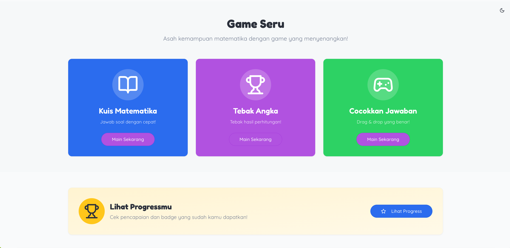

# Math Kids Play 🎮🧮

**Math Kids Play** adalah aplikasi pembelajaran interaktif berbasis web untuk anak-anak, yang menggabungkan edukasi matematika dengan pengalaman bermain yang menyenangkan. Dirancang dengan **UI dinamis**, **komponen interaktif**, dan **backend ringan** agar anak-anak bisa belajar sambil bermain.

---

## 📸 Screenshot




Preview UI/UX terkini dengan fitur interaktif dan komponen dinamis.
---

## 🚀 Fitur Utama

- **UI Interaktif:** Komponen dasar yang ramah anak untuk pengalaman belajar menyenangkan.  
- **Game Edukasi Matematika:** Latihan berhitung, penjumlahan, pengurangan, dan permainan angka.  
- **Frontend Modern:** Dibangun menggunakan **TypeScript**, **TailwindCSS**, dan **Vite** untuk performa tinggi.  
- **Backend Ringan:** Node.js + Express untuk mendukung operasi server minimalis.  
- **Konfigurasi Mudah:** Tinggal clone, `npm install`, dan `npm run dev`.

---

## 🛠️ Instalasi & Setup

1. **Clone repository:**
```bash
git clone https://github.com/rasidi3112/math-kids-play.git
cd math-kids-play

Install dependencies:
npm install
Jalankan server development:
npm run dev
Akses aplikasi di browser:
http://localhost:3000
